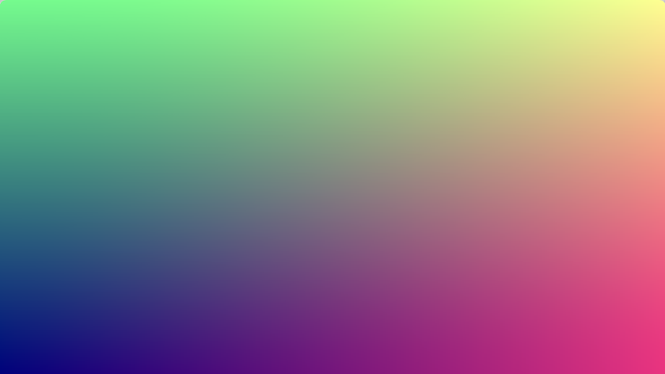

# Shader Quickstart



The goal of this project is to provide a set of shader project starter templates for
different development environments so that more time can be spent on creating the shader
and less time spent on setting up the environment.

The environments are listed below from the fewest dependencies to the most. For example,
the first `vanilla-webgl` project uses only native JavaScript. It is simple in terms of
everything being in one file, but will be a slower environment in which to develop. Conversely,
the `vite-webgl` environment has more dependencies and a more complex project structure, but
with Vite's Hot Module Replacement (HMR) the result of your changes are instantly updated
in the browser.

This has been created in a MacOS environment. I'm not sure how these will translate to other
operating systems.

## Environments

This repository is a monorepo of several different self-contained environments. Each folder
should be able to be copied outside of this repository and used on its own as a starter environment.

### vanilla-webgl: WebGL using JavaScript

[WebGL](https://developer.mozilla.org/en-US/docs/Web/API/WebGL_API), or Web Graphics Library,
is a JavaScript API that allows you to render interactive 2D and 3D graphics within any compatible
web browser without the need for plug-ins. It works by providing an interface to the device's GPU,
enabling high-performance graphics rendering directly within web pages using JavaScript.

Use a server like Node's [http-server](https://www.npmjs.com/package/http-server) or Python's
[http.server module](https://docs.python.org/3/library/http.server.html) to serve the files to the browser.

```
npx http-server ./vanilla-webgl/src
```

### vite-webgl: WebGL using JavaScript compiled/served using Vite

[Vite](https://vitejs.dev) is a fast build tool. This project uses Vite to serve the project,
facilitating fast iteration.

```
cd vite-webgl
npm run dev
```

### node-glslify: WebGL using Node, GLSL and Webpack

[glslify](https://github.com/glslify/glslify) is a tool for managing and bundling GLSL (OpenGL Shading
Language) code in a modular way. It allows you to write shaders as reusable, modular pieces by
leveraging a CommonJS-like syntax (similar to Node.js’s require/import). This project uses
[Webpack](https://webpack.js.org) to compile and serve the project, speeding up iteration.

Run:

```
cd node-glslify
npx webpack serve
```

### p5js-webgl: WebGL using p5.js

[p5.js](http://p5js.org) is a popular JavaScript library for creative coding. It includes support
for a [shader library](https://p5js.org/reference/p5/shader/).

Use a server like Node's [http-server](https://www.npmjs.com/package/http-server) or Python's
[http.server module](https://docs.python.org/3/library/http.server.html) to serve the files to the browser.

```
npx http-server ./p5js-webgl/src
```

### threejs-webgl: WebGL using Three.js (with Vite)

[Three.js](https://threejs.org) is a JavaScript library that simplifies the creation of 3D graphics
in the browser by leveraging WebGL. It provides an extensive set of tools for rendering, animating,
and interacting with 3D scenes, including support for geometries, materials, lighting, and cameras.

```
cd threejs-webgl
npm run dev
```

### python-moderngl: Python using the ModernGL Library

[ModernGL](https://github.com/moderngl/moderngl) is a high-level Python wrapper for OpenGL
that simplifies the process of creating and managing OpenGL contexts and rendering graphics.


### Shadertoy

[Shadertoy](https://www.shadertoy.com) is a popular online platform for creating and sharing WebGL
shaders.

Go to [https://www.shadertoy.com/new](https://www.shadertoy.com/new), paste in the following code, and run:

```
void mainImage( out vec4 fragColor, in vec2 fragCoord )
{
    // Normalized pixel coordinates (from 0 to 1)
    vec2 uv = fragCoord/iResolution.xy;

    fragColor = vec4(uv.x, uv.y, 0.5, 1.0);
}
```

## Contribution

If you'd like to contribute a new environment to this repository, then please fork this
repository and make a pull request. Your PR should have a new folder that represents the environment
and its organization should be in line with how this repository is already organized. The code in
the project should be idiomatic to that environment - that is to say it should be formatted in the
way that developers using that environment are used to. Additionally, the shader should match the
screenshot at the top of the README that has been implemented in all other environments.

## License

The original work in this project is marked with <a href="https://creativecommons.org/publicdomain/zero/1.0/?ref=chooser-v1" target="_blank" rel="license noopener noreferrer" style="display:inline-block;">CC0 1.0</a>.

Licenses belonging to other third-party code referenced or included in this repository supersede
this license. This includes but is not limited to the following licenses:

- https://github.com/processing/p5.js/blob/main/license.txt
- https://www.shadertoy.com/terms
- https://github.com/mrdoob/three.js/blob/dev/LICENSE
